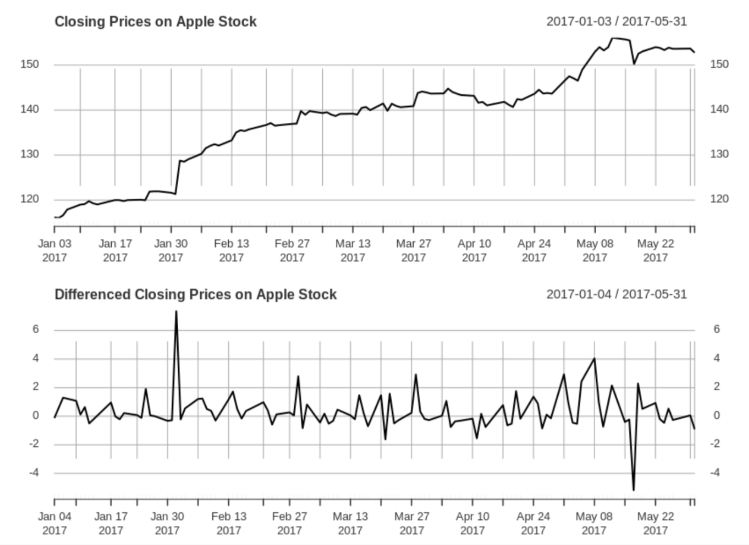
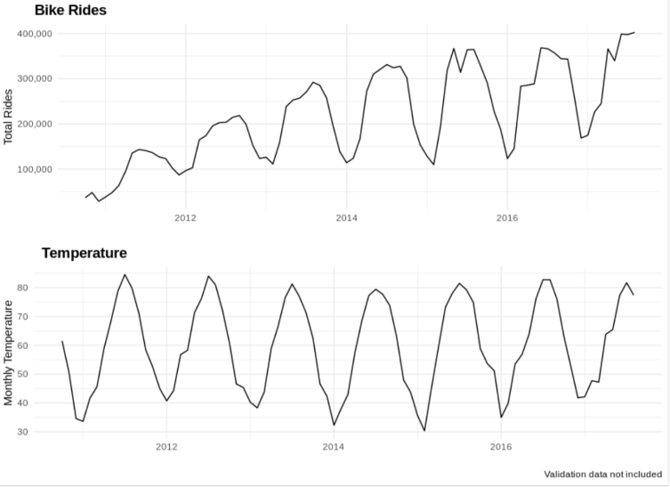

Forecasting Capital Bikeshare usage with ARIMA
==============================================

------------------------------------------------------------------------

In this post, I’ll be modeling monthly ridership in the DC BikeShare
program using ARIMA modeling. The original data was gathered from the
official DC Bike Share
[site](https://s3.amazonaws.com/capitalbikeshare-data/index.html), spans
bike trips logged from October, 2010 to August, 2018, and has been
aggregated up from a daily level.

Having used this data
[previously](https://rsolter.github.io/r/forecasting/Monthly_Bike_Forecast_ETS/)
to forecast with exponential smoothing models, I wanted to try ARIMA out
in part because it allows for explanatory variables in the regression.
In this case, I’ve added monthly average temperatures as a regressor.
The data was
[downloaded](https://www.ncei.noaa.gov/access/search/data-search/global-summary-of-the-month)
from NOAA and represents measurements from the Regan National Airport
weather station.

------------------------------------------------------------------------

**Stationarity**

A requirement of ARIMA modeling is stationarity of the series which is
achieved by having *time invariant* mean, variance, and co-variance of
the series. Any time series with a trend or seasonality is not
stationary. Stationarity is tested formally using the augmented
Dickey-Fuller test.

One tool used to achieve stationarity is **differencing.** or computing
the difference between consecutive observations. As an example, we can
show this using stock data downloaded using the **quantmod** R package.
By differencing the data by just one observation, the trend in the stock
prices completely disappears:

    ## [1] "AAPL"



However, was that enough to achieve stationarity? Formally, stationarity
can be assessed by using one of many unit tests, including the
Kwiatkowski-Phillips-Schmidt-Shin (KPSS) test. In KPSS the test’s null
hypothesis is that the data are stationary, and we look for evidence
that the null hypothesis is false. Consequently, small p-values (e.g.,
less than 0.05) suggest that differencing is required. Read more
[here](https://nwfsc-timeseries.github.io/atsa-labs/sec-boxjenkins-aug-dickey-fuller.html).

In the first test on the raw data, the null hypothesis of stationarity
is rejected. Run a second time on differenced data, the null hypothesis
is not rejected, indicating that our differencing worked!

    ## 
    ##  KPSS Test for Level Stationarity
    ## 
    ## data:  closingApple
    ## KPSS Level = 1.9588, Truncation lag parameter = 4, p-value = 0.01

    ## 
    ##  KPSS Test for Level Stationarity
    ## 
    ## data:  DclosingApple
    ## KPSS Level = 0.187, Truncation lag parameter = 4, p-value = 0.1

**ARIMA Theory**

ARIMA is an acronym for Auto Regressive (AR) Integrated (I) Moving
Average (MA) and can be implemented in R using the automated function
`auto.arima` from the forecast package. ARIMA modeling is best
understood by breaking it into its components:

**Auto-regressive** models forecast using a linear combination of past
values of the variable. An AR model of order *p* can be written as:

*y*<sub>*t*</sub> = *c* + *θ**y*<sub>*t* − 1</sub> + *θ**y*<sub>*t* − 2</sub> + ... + *θ**y*<sub>*t* − *p*</sub> + *ϵ*<sub>*t*</sub>

Where *ϵ* is white noise and the model is denoted **AR(*p*)**, an
auto-regressive model of order p. Read more
[here](https://otexts.com/fpp2/AR.html)

**Moving Average** models use past values forecast errors as regressors
for forecasting:

*y*<sub>*t*</sub> = *c* + *ϵ*<sub>*t*</sub> + *θ*<sub>1</sub>*ϵ*<sub>*t* − 1</sub> + *θ*<sub>2</sub>*ϵ*<sub>*t* − 2</sub> + ... + *θ*<sub>*q*</sub>*ϵ*<sub>*t* − *q*</sub>
 Again, in this model, *ϵ* is white noise and the model is denoted
**MA(*q*)**, a moving-average model of order q. Read more
[here](https://otexts.com/fpp2/MA.html)

**ARIMA Formulation**

Combining the autoregression and moving average model, we obtain a
non-seasonal ARIMA model which is denoted as
**ARIMA**(*p,d,q*)**model**, where

-   p - order of the auto-regressive part
-   d - degree of first differencing involved
-   q - order of the moving average part

The **seasonal** version of ARIMA builds upon this to include 4
additional seasonal terms:

-   m - number of observations per year (12 for months, 4 for quarters,
    etc.)
-   P - order of the seasonal auto-regressive part
-   D - degree of first differencing involved for seasonal observations
-   Q - order of the seasonal moving average part

------------------------------------------------------------------------

#### Application to DC Bike Share

Now we’ll apply the ARIMA model to the monthly bike share data while
using the temperature data as a regressor.

From the initial plot of the bike data, we can tell the data has clear
seasonality with many fewer riders in the winter months. At the same
time, we see an growth in the number of total riders that has appeared
to slow in recent years. In the plot for temperature we see a
predicatble seasonality whose peaks and valleys remain almost equal in
size throughout the entire time frame:



To achieve **stationarity** in our time series, we need to remove all
trend and seasonality components from the data. A decomposed version of
the series can be visualized using the decompose() function. Since the
seasonal fluctuations appear to grow over time we feed a multiplicative
argument to the (seasonal component) type parameter:

``` r
decompose(bike_train, type="multiplicative") %>% autoplot() + 
  xlab("Year") +
  ggtitle("Classical multiplicative decomposition
    of monthly bike rentals") + theme_minimal() +
  theme(plot.title = element_text(hjust = 0.5)) + xlab("")
```


Removing the seasonality alone from the time series using seasadj() does
not yield a stationary timeseries:

``` r
decomp_mult <- decompose(bike_train)
deseasonal_cnt <- seasadj(decomp_mult) 

deseasonal_cnt %>%
  autoplot() + 
  xlab("Year") + scale_y_continuous(label=comma) +
  ggtitle("Monthly bike rentals with annual seasonality Removed") + theme_minimal() +
  theme(plot.title = element_text(hjust = 0.5)) + xlab("")
```


``` r
tseries::kpss.test(deseasonal_cnt)
```

    ## 
    ##  KPSS Test for Level Stationarity
    ## 
    ## data:  deseasonal_cnt
    ## KPSS Level = 1.9721, Truncation lag parameter = 3, p-value = 0.01

Examining the ACF and PACF plots indicate that differencing the series
by 1 observation could help:


And running the KPSS test confirms that differencing the data does
return a stationary series:

``` r
deseasoned_count_d1 = diff(deseasonal_cnt, differences = 1)
tseries::kpss.test(deseasoned_count_d1) 
```

    ## 
    ##  KPSS Test for Level Stationarity
    ## 
    ## data:  deseasoned_count_d1
    ## KPSS Level = 0.086888, Truncation lag parameter = 3, p-value = 0.1

``` r
#deseasoned_count_d2 = diff(deseasonal_cnt, differences = 2)
#tseries::kpss.test(deseasoned_count_d2) 
```

From the plot, it appears that the differenced, deseasoned data has a
stationary mean:


------------------------------------------------------------------------

Running ACF, PACF plots of the differeced data to see what values for
*q*, *p* would be for an ARIMA model:

The ACF plot shows significant auto-correlations at lags 1,6,10,12 (*q*)


The PACF plot shows significant partial-correlations at 5,6, and 9 (*p*)


#### Modeling

Using the findings from the ACF, PACF plots above, an ARIMA(2,1,9) model
is chosen. Evaluating the diagnostic plots for the (2,1,9) residuals
return a seemingly random residual plot and no significant
autocorrelations.

    ## 
    ## Call:
    ## arima(x = deseasoned_count_d1, order = c(2, 1, 9))
    ## 
    ## Coefficients:
    ##           ar1      ar2      ma1      ma2      ma3      ma4      ma5     ma6
    ##       -0.6738  -0.6415  -0.5796  -0.1744  -0.8391  -0.0723  -0.0498  0.4855
    ## s.e.   0.1069   0.1014   0.1965   0.1638   0.1301   0.1766   0.1902  0.1856
    ##          ma7     ma8      ma9
    ##       0.5922  0.3399  -0.6488
    ## s.e.  0.1361  0.1390   0.1653
    ## 
    ## sigma^2 estimated as 434834666:  log likelihood = -1067.37,  aic = 2158.74


*auto.arima()*

Comparing the ARIMA(2,1,9) to the results from auto.arima we can see the
automated function does not account for the autocorrelation at q(9).
Furthermore, the AIC is slightyl smaller in the ARIMA(2,1,9) model.

``` r
auto.arima(deseasoned_count_d1)
```

    ## Series: deseasoned_count_d1 
    ## ARIMA(2,0,2) with non-zero mean 
    ## 
    ## Coefficients:
    ##          ar1      ar2      ma1     ma2      mean
    ##       1.5664  -0.7621  -1.8584  0.9260  2642.453
    ## s.e.  0.0843   0.0814   0.0881  0.0825   905.082
    ## 
    ## sigma^2 estimated as 669557486:  log likelihood=-1087.21
    ## AIC=2186.42   AICc=2187.39   BIC=2201.68

``` r
fit2 <- auto.arima(deseasoned_count_d1,seasonal=FALSE) 
tsdisplay(residuals(fit2), lag.max=45, main='(2,0,2) Model Residuals')
```


#### Forecasting and Back-Testing

To fully evaluate the model’s predictive power, we set aside the last 12
months of the *deseasonal\_cnt* object and compare our predictions to
what was actually observed.

------------------------------------------------------------------------

Comparing both datasets, we see similar behavior. Both datasets are
clearly seasonal while the bike dataset does report a clear growth trend
through 2016 before slowing in the following years.

Will give auto.arima a shot, using default parameters. Returns a MAPE of
11.8%

    ## Series: bike_train 
    ## Regression with ARIMA(0,1,2)(1,0,0)[12] errors 
    ## 
    ## Coefficients:
    ##           ma1      ma2    sar1     drift       xreg
    ##       -0.3702  -0.4345  0.5719  3247.913  3798.2219
    ## s.e.   0.1142   0.1118  0.1043  1029.499   365.4886
    ## 
    ## sigma^2 estimated as 535667157:  log likelihood=-940.59
    ## AIC=1893.17   AICc=1894.29   BIC=1907.61
    ## 
    ## Training set error measures:
    ##                     ME     RMSE     MAE      MPE     MAPE      MASE        ACF1
    ## Training set -291.7736 22292.25 18183.7 1.379566 11.88621 0.4186552 -0.02153787


Residual inspection:


    ## 
    ##  Ljung-Box test
    ## 
    ## data:  Residuals from Regression with ARIMA(0,1,2)(1,0,0)[12] errors
    ## Q* = 27.536, df = 12, p-value = 0.006463
    ## 
    ## Model df: 5.   Total lags used: 17

Auto.arima without a regressor

    ## Series: bike_train 
    ## ARIMA(0,1,4)(0,1,0)[12] 
    ## 
    ## Coefficients:
    ##           ma1      ma2     ma3      ma4
    ##       -0.7402  -0.1356  0.3388  -0.3313
    ## s.e.   0.1096   0.1548  0.1198   0.1373
    ## 
    ## sigma^2 estimated as 964359991:  log likelihood=-822.08
    ## AIC=1654.15   AICc=1655.09   BIC=1665.4
    ## 
    ## Training set error measures:
    ##                     ME     RMSE      MAE       MPE     MAPE      MASE
    ## Training set -3688.112 27691.88 19733.45 -3.736181 9.817585 0.4543361
    ##                    ACF1
    ## Training set 0.01308924


Residual inspection:


    ## 
    ##  Ljung-Box test
    ## 
    ## data:  Residuals from ARIMA(0,1,4)(0,1,0)[12]
    ## Q* = 46.948, df = 13, p-value = 9.858e-06
    ## 
    ## Model df: 4.   Total lags used: 17

    ## Series: bike_train 
    ## Regression with ARIMA(0,1,2)(1,0,0)[12] errors 
    ## 
    ## Coefficients:
    ##           ma1      ma2    sar1     drift       xreg
    ##       -0.3702  -0.4345  0.5719  3247.913  3798.2219
    ## s.e.   0.1142   0.1118  0.1043  1029.499   365.4886
    ## 
    ## sigma^2 estimated as 535667157:  log likelihood=-940.59
    ## AIC=1893.17   AICc=1894.29   BIC=1907.61
    ## 
    ## Training set error measures:
    ##                     ME     RMSE     MAE      MPE     MAPE      MASE        ACF1
    ## Training set -291.7736 22292.25 18183.7 1.379566 11.88621 0.4186552 -0.02153787


    ## 
    ## Forecast method: Regression with ARIMA(0,1,2)(1,0,0)[12] errors
    ## 
    ## Model Information:
    ## Series: bike_train 
    ## Regression with ARIMA(0,1,2)(1,0,0)[12] errors 
    ## 
    ## Coefficients:
    ##           ma1      ma2    sar1     drift       xreg
    ##       -0.3702  -0.4345  0.5719  3247.913  3798.2219
    ## s.e.   0.1142   0.1118  0.1043  1029.499   365.4886
    ## 
    ## sigma^2 estimated as 535667157:  log likelihood=-940.59
    ## AIC=1893.17   AICc=1894.29   BIC=1907.61
    ## 
    ## Error measures:
    ##                     ME     RMSE     MAE      MPE     MAPE      MASE        ACF1
    ## Training set -291.7736 22292.25 18183.7 1.379566 11.88621 0.4186552 -0.02153787
    ## 
    ## Forecasts:
    ##          Point Forecast    Lo 80    Hi 80    Lo 95    Hi 95
    ## Sep 2017       382729.8 353069.0 412390.7 337367.5 428092.2
    ## Oct 2017       369534.4 334480.6 404588.3 315924.2 423144.7
    ## Nov 2017       288350.4 252820.7 323880.1 234012.5 342688.3
    ## Dec 2017       221016.7 185017.5 257015.9 165960.7 276072.7
    ## Jan 2018       212085.9 175623.2 248548.5 156321.0 267850.7
    ## Feb 2018       267217.6 230297.3 304137.9 210752.8 323682.4
    ## Mar 2018       274091.4 236719.0 311463.8 216935.3 331247.6
    ## Apr 2018       351338.7 313519.6 389157.7 293499.4 409177.9
    ## May 2018       400538.5 362278.0 438799.0 342024.1 459052.9
    ## Jun 2018       424274.3 385577.4 462971.2 365092.5 483456.1
    ## Jul 2018       432604.7 393476.2 471733.1 372762.9 492446.4
    ## Aug 2018       447375.2 407819.9 486930.4 386880.6 507869.7
